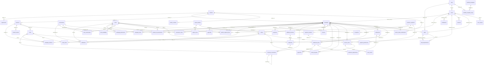

# ERD（由外鍵關係自動產生）

> 由 `npm run docs:gen` 產生。只畫外鍵關係；欄位請見 [DATA_DICTIONARY.md](DATA_DICTIONARY.md)。

```mermaid
erDiagram
    vendors ||--o{ agreements : "vendor_id"
    campaigns ||--o{ approvals : "campaign_id"
    communities ||--o{ attributions : "community_id"
    hosts ||--o{ attributions : "host_id"
    orders ||--o{ attributions : "order_id"
    campaigns ||--o{ campaign_hosts : "campaign_id"
    hosts ||--o{ campaign_hosts : "host_id"
    campaigns ||--o{ campaign_placements : "campaign_id"
    communities ||--o{ campaign_placements : "community_id"
    hosts ||--o{ campaign_placements : "host_id"
    campaigns ||--o{ campaign_products : "campaign_id"
    products ||--o{ campaign_products : "product_id"
    skus ||--o{ campaign_products : "sku_id"
    users ||--o{ campaigns : "owner_user_id"
    vendors ||--o{ campaigns : "vendor_id"
    service_cases ||--o{ case_events : "case_id"
    campaigns ||--o{ commission_rules : "campaign_id"
    hosts ||--o{ commission_rules : "host_id"
    campaigns ||--o{ exceptions : "campaign_id"
    users ||--o{ exceptions : "owner_user_id"
    campaigns ||--o{ expenses : "campaign_id"
    campaigns ||--o{ fulfillment_batches : "campaign_id"
    hosts ||--o{ host_availability : "host_id"
    communities ||--o{ host_communities : "community_id"
    hosts ||--o{ host_communities : "host_id"
    import_batches ||--o{ import_errors : "batch_id"
    campaigns ||--o{ inventory_movements : "campaign_id"
    inventory_movements ||--o{ inventory_movements : "reverses_id"
    shipments ||--o{ inventory_movements : "shipment_id"
    skus ||--o{ inventory_movements : "sku_id"
    campaigns ||--o{ invoices : "campaign_id"
    users ||--o{ notifications : "recipient_user_id"
    orders ||--o{ order_items : "order_id"
    skus ||--o{ order_items : "sku_id"
    campaigns ||--o{ orders : "campaign_id"
    import_batches ||--o{ orders : "import_batch_id"
    communities ||--o{ partner_segment_links : "community_id"
    hosts ||--o{ partner_segment_links : "host_id"
    customer_segments ||--o{ partner_segment_links : "segment_id"
    campaigns ||--o{ payments : "campaign_id"
    settlement_items ||--o{ payments : "settlement_item_id"
    products ||--o{ product_assets : "product_id"
    campaigns ||--o{ product_fit_assessments : "campaign_id"
    hosts ||--o{ product_fit_assessments : "host_id"
    products ||--o{ product_fit_assessments : "product_id"
    vendors ||--o{ products : "vendor_id"
    campaigns ||--o{ refund_requests : "campaign_id"
    service_cases ||--o{ refund_requests : "case_id"
    orders ||--o{ refund_requests : "order_id"
    hosts ||--o{ segment_evidence : "host_id"
    customer_segments ||--o{ segment_evidence : "segment_id"
    segment_evidence ||--o{ segment_preferences : "evidence_id"
    customer_segments ||--o{ segment_preferences : "segment_id"
    users ||--o{ service_cases : "assignee_user_id"
    campaigns ||--o{ service_cases : "campaign_id"
    orders ||--o{ service_cases : "order_id"
    users ||--o{ sessions : "user_id"
    settlement_items ||--o{ settlement_adjustments : "item_id"
    settlements ||--o{ settlement_adjustments : "settlement_id"
    campaigns ||--o{ settlement_items : "campaign_id"
    hosts ||--o{ settlement_items : "host_id"
    settlements ||--o{ settlement_items : "settlement_id"
    campaigns ||--o{ settlements : "campaign_id"
    fulfillment_batches ||--o{ shipments : "batch_id"
    campaigns ||--o{ shipments : "campaign_id"
    skus ||--o{ shipments : "sku_id"
    products ||--o{ skus : "product_id"
    tasks ||--o{ task_dependencies : "depends_on_task_id"
    tasks ||--o{ task_dependencies : "task_id"
    users ||--o{ tasks : "assignee_user_id"
    campaigns ||--o{ tasks : "campaign_id"
    roles ||--o{ tasks : "owner_role"
    users ||--o{ user_scopes : "user_id"
    roles ||--o{ users : "role_key"
    vendors ||--o{ vendor_contacts : "vendor_id"
    campaigns ||--o{ vendor_intake_submissions : "campaign_id"
    vendors ||--o{ vendor_intake_submissions : "vendor_id"
    roles ||--o{ workflow_template_steps : "owner_role"
    workflow_templates ||--o{ workflow_template_steps : "template_id"
```

所有業務表另帶 `organization_id → organizations`（多租戶隔離，未畫出以保持圖面清楚）。
